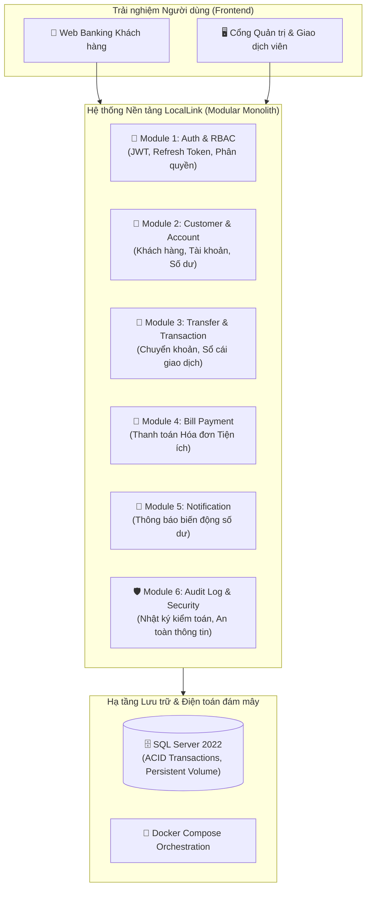

# 🏦 InterLink Banking — Tổng quan Dự án & Tài liệu Nghiệp vụ

**Tên dự án**: InterLink Banking  
**Slogan**: *Cloud-native Connected Regional Banking & Local Services Platform*  
*(Nền tảng Ngân hàng Số Liên kết Khu vực & Dịch vụ Tiện ích Địa phương trên Điện toán đám mây)*

---

## 1. Giới thiệu & Tầm nhìn Dự án

Trong kỷ nguyên số hóa ngành tài chính, các ngân hàng khu vực, ngân hàng hợp tác xã hoặc các tổ chức tín dụng địa phương thường gặp khó khăn trong việc tiếp cận các giải pháp công nghệ hiện đại do chi phí triển khai hệ thống lõi (Core Banking) quá lớn và sự phân mảnh phức tạp của các giải pháp Microservices.

**InterLink Banking** ra đời nhằm giải quyết triệt để bài toán này:
- Cung cấp một nền tảng **Ngân hàng số hiện đại, tin cậy và có tốc độ xử lý cao**.
- Tích hợp sâu rộng giữa **Nghiệp vụ Tài chính - Ngân hàng cốt lõi** và **Hệ sinh thái Thanh toán dịch vụ công / Tiện ích đời sống tại địa phương**.
- Áp dụng kiến trúc **Modular Monolith kết hợp Clean Architecture**, mang lại sự đơn giản trong vận hành, dễ dàng mở rộng và tối ưu chi phí hạ tầng.

---

## 2. Các Đối tượng Người dùng (User Personas)

1. **Khách hàng Cá nhân (Retail Customer)**:
   - Đăng ký định danh, mở tài khoản ngân hàng trực tuyến.
   - Quản lý số dư, xem lịch sử giao dịch và sao kê điện tử.
   - Chuyển tiền nhanh chóng, thanh toán hóa đơn điện/nước/internet chỉ với vài thao tác.
2. **Doanh nghiệp & Hộ kinh doanh Địa phương (Local Merchant)**:
   - Nhận thanh toán từ khách hàng thông qua tài khoản ngân hàng và mã định danh.
   - Quản lý dòng tiền kinh doanh và đối soát thanh toán tự động.
3. **Giao dịch viên & Nhân viên Chi nhánh (Teller / Bank Officer)**:
   - Tiếp nhận và phê duyệt yêu cầu mở tài khoản, xử lý hạn mức giao dịch.
   - Hỗ trợ khách hàng tra cứu giao dịch và xử lý khiếu nại.
4. **Quản trị viên Hệ thống (System Admin / Auditor)**:
   - Phân quyền người dùng (RBAC), kiểm soát danh mục đối tác thanh toán hóa đơn.
   - Giám sát toàn vẹn hệ thống và tra cứu nhật ký kiểm toán (Audit Logs) phục vụ tuân thủ pháp lý.

---

## 3. Phân hệ Nghiệp vụ Chi tiết (Core Modules)

### Module 1: Định danh, Xác thực & Phân quyền (Authentication & RBAC)
- Xác thực chuẩn Token-based qua `Access Token (JWT)` và `Refresh Token`.
- Phân quyền theo vai trò (Role-Based Access Control - RBAC) và chính sách (Policy-based).
- Bảo vệ dữ liệu nhạy cảm và chống tấn công brute-force.

### Module 2: Quản lý Khách hàng & Tài khoản (Customer & Bank Account)
- Quản lý hồ sơ khách hàng (thông tin cá nhân, định danh, trạng thái tài khoản).
- Quản lý nhiều loại tài khoản: Tài khoản thanh toán (Checking), Tài khoản tiết kiệm (Savings).
- Đảm bảo tính toán số dư chính xác tuyệt đối, chống lỗi Race Condition bằng cơ chế Khóa bi quan / lạc quan (Pessimistic / Optimistic Locking).

### Module 3: Động cơ Chuyển tiền & Sổ cái Giao dịch (Transfer & Transaction Ledger)
- Chuyển tiền nội bộ giữa các tài khoản LocalLink với cam kết ACID Transaction.
- Cập nhật số dư 2 chiều (Double-entry bookkeeping) đồng thời sinh Transaction Record.
- Quản lý hạn mức chuyển khoản theo ngày và theo từng giao dịch.

### Module 4: Thanh toán Tiện ích & Hóa đơn Địa phương (Bill Payment)
- Kết nối với các nhà cung cấp dịch vụ tiện ích địa phương: Điện lực, Cấp thoát nước, Viễn thông, Thu học phí / Phí hành chính.
- Tra cứu nợ cước theo mã khách hàng và tự động trừ tiền trong tài khoản để thanh toán.
- Lưu trữ hóa đơn điện tử và biên lai thanh toán.

### Module 5: Trung tâm Thông báo (Notification Engine)
- Gửi thông báo tức thì khi có biến động số dư tài khoản (tiền vào/tiền ra).
- Nhắc lịch thanh toán hóa đơn sắp đến hạn hoặc các thông báo bảo trì hệ thống.

### Module 6: Nhật ký Kiểm toán & Báo cáo (Audit Log & Compliance)
- Tự động ghi nhận tất cả hành động nhạy cảm: Đăng nhập thất bại, thay đổi mật khẩu, phê duyệt hạn mức, giao dịch vượt ngưỡng.
- Đảm bảo dữ liệu kiểm toán là bất biến (Immutable), phục vụ việc truy vết và tuân thủ tiêu chuẩn tài chính.

---

## 4. Kiến trúc Kỹ thuật (Technical Architecture)

Hệ thống được tổ chức theo mô hình **Modular Monolith + Clean Architecture** gồm 5 tầng rõ ràng:

1. **`LocalLink.API` (Presentation Layer)**:
   - Cung cấp HTTP REST Endpoints, Routing, Model Binding.
   - Chứa Global Exception Middleware (chuẩn ProblemDetails), CORS Configuration, Health Checks và OpenAPI / Swagger UI.
2. **`LocalLink.Application` (Use Cases Layer)**:
   - Chứa logic ứng dụng, DTOs, Interface trừu tượng, Command/Query handlers và Validators.
   - Độc lập với cơ sở dữ liệu hay giao thức truyền thông.
3. **`LocalLink.Domain` (Core Domain Layer)**:
   - Trung tâm của hệ thống, chứa các Entity, Value Objects, Domain Exceptions và Enums.
   - Không phụ thuộc vào bất kỳ thư viện bên ngoài hay tầng nào khác.
4. **`LocalLink.Infrastructure` (Data Access Layer)**:
   - Triển khai Entity Framework Core `ApplicationDbContext`, cấu hình Fluent API, Database Migrations, Repositories và kết nối SQL Server 2022.
5. **`LocalLink.Shared` (Shared Layer)**:
   - Chứa các hằng số chung (AppConstants), helper primitives dùng xuyên suốt giải pháp.

---

## 5. Lộ trình Triển khai (10-Milestone Roadmap)

- [x] **Milestone 1: Project Foundation & DevOps** ✅ *(Đã hoàn thành)*
  - Setup .NET 10 Web API Clean Architecture, Nuxt 3 Quasar Frontend, SQL Server 2022 Docker, Docker Compose, Health Check `/health`, Swagger `/swagger`, Persistence Volume.
- [ ] **Milestone 2: Database Design & Core Banking Schema**
  - Thiết kế quan hệ bảng CSDL hoàn chỉnh: Customer, Account, Transaction, Transfer, Bill, Provider, AuditLog, User, Role.
- [ ] **Milestone 3: Authentication + JWT + Refresh Token + RBAC**
  - Đăng ký, đăng nhập, cấp phát JWT, middleware kiểm tra token và phân quyền.
- [ ] **Milestone 4: Customer Management & Banking Accounts**
  - Mở tài khoản, cấp phát số tài khoản, quản lý trạng thái và truy vấn số dư.
- [ ] **Milestone 5: Transfer Engine, Transaction Ledger & Audit Logging**
  - Logic chuyển khoản an toàn (ACID transaction, locking), sao kê và ghi audit log tự động.
- [ ] **Milestone 6: Frontend Banking UI**
  - Xây dựng giao diện Web Banking đầy đủ với Quasar components (Dashboard, Chuyển tiền, Lịch sử giao dịch).
- [ ] **Milestone 7: Bill Payment System & Notifications**
  - Tính năng thanh toán hóa đơn dịch vụ địa phương và thông báo biến động số dư.
- [ ] **Milestone 8: Docker Testing Improvements & Stress Testing**
  - Tối ưu hóa hiệu năng container, kịch bản test chịu tải và concurrency test.
- [ ] **Milestone 9: Cloud Deployment (Azure) & CI/CD Pipelines**
  - Tích hợp GitHub Actions CI/CD và chuẩn bị deploy lên Microsoft Azure Cloud.
- [ ] **Milestone 10: Infrastructure as Code (Terraform) & Monitoring (Prometheus/Grafana)**
  - Tự động hóa hạ tầng bằng Terraform và giám sát số liệu APM/Metrics thời gian thực.
