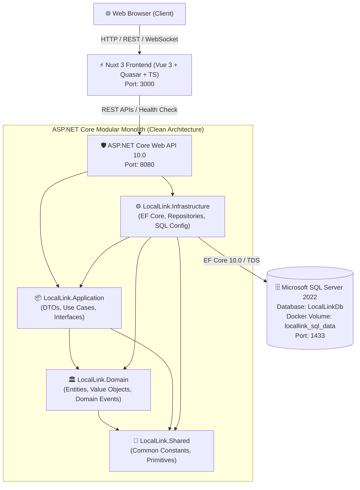
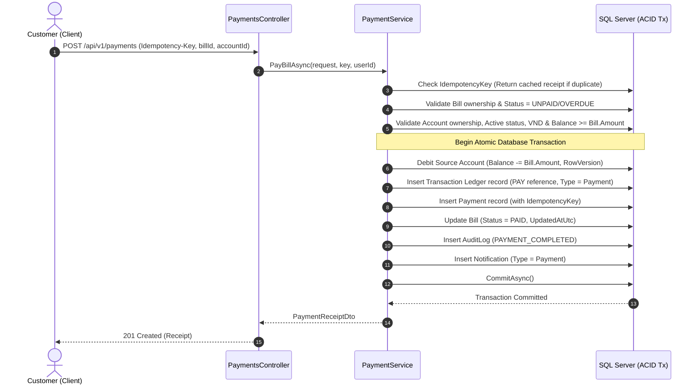

# InterLink Banking

**Cloud-native Connected Regional Banking & Local Services Platform**

InterLink Banking is an enterprise-ready, cloud-native financial platform designed for connected regional banking and localized digital financial services. Built with a robust **Modular Monolith + Clean Architecture**, the platform provides high-throughput transaction processing, resilient data persistence, and modern reactive client experiences.

> [!TIP]
> 📖 **Xem tài liệu hướng dẫn chạy dự án chi tiết bằng Tiếng Việt**: [Docs/HUONG_DAN_CHAY_DU_AN.md](Docs/HUONG_DAN_CHAY_DU_AN.md)

---

## Architecture Overview



---

## Tech Stack

### Backend
- **Language**: C# 14 / .NET 10.0
- **Framework**: ASP.NET Core Web API
- **ORM / Persistence**: Entity Framework Core 10.0 (SQL Server Provider)
- **API Documentation**: OpenAPI / Swagger UI (Swashbuckle)
- **Diagnostics**: ASP.NET Core Health Checks (Process + EF Core SQL Server check)
- **Error Standard**: RFC 7807 ProblemDetails Global Exception Handling
- **Security & Networking**: Configurable CORS Policy

### Frontend
- **Framework**: Nuxt 3 (SSR & SPA modes)
- **Core Library**: Vue.js 3 + TypeScript
- **Component UI**: Quasar Framework 2.x
- **Icons & Typography**: Material Icons, Outfit & Plus Jakarta Sans
- **State & HTTP**: Built-in Nitro Server Engine + `$fetch` Client with Runtime Configuration

### Database & DevOps
- **Database Engine**: Microsoft SQL Server 2022 (`mcr.microsoft.com/mssql/server:2022-latest`)
- **Containerization**: Docker & Multi-stage Dockerfiles (SDK/Builder -> Minimal Runtime)
- **Orchestration**: Docker Compose with Health Checks and Named Persistent Volumes
- **Configuration**: Environment Variables & `.env` files

---

## Project Structure

```text
LocalLink/
├── backend/
│   ├── LocalLink.sln
│   ├── Dockerfile
│   ├── dotnet-tools.json
│   └── src/
│       ├── LocalLink.API/                    # Presentation / Web API Layer
│       │   ├── Controllers/
│       │   │   └── SystemController.cs
│       │   ├── Extensions/
│       │   │   ├── CorsExtensions.cs
│       │   │   ├── HealthCheckExtensions.cs
│       │   │   └── SwaggerExtensions.cs
│       │   ├── Middleware/
│       │   │   └── GlobalExceptionHandlerMiddleware.cs
│       │   ├── Program.cs
│       │   ├── appsettings.json
│       │   └── appsettings.Development.json
│       │
│       ├── LocalLink.Application/            # Application Business Logic Layer
│       │   ├── DTOs/
│       │   │   └── SystemStatusDto.cs
│       │   ├── Interfaces/
│       │   ├── Services/
│       │   └── Validators/
│       │
│       ├── LocalLink.Domain/                 # Core Domain Entities & Rules
│       │   ├── Entities/
│       │   │   └── SystemInfo.cs
│       │   ├── Enums/
│       │   ├── Exceptions/
│       │   └── Interfaces/
│       │
│       ├── LocalLink.Infrastructure/         # Data Access & External Services Layer
│       │   ├── DependencyInjection/
│       │   │   └── DependencyInjection.cs
│       │   ├── Persistence/
│       │   │   ├── ApplicationDbContext.cs
│       │   │   ├── Configurations/
│       │   │   │   └── SystemInfoConfiguration.cs
│       │   │   └── Migrations/
│       │   │       └── 20260818045017_InitialCreate.cs
│       │   └── Repositories/
│       │
│       └── LocalLink.Shared/                 # Shared Primitives & Constants
│           └── Common/
│               └── AppConstants.cs
│
├── frontend/
│   ├── Dockerfile
│   ├── nuxt.config.ts
│   ├── package.json
│   ├── tsconfig.json
│   ├── app.vue
│   ├── pages/
│   │   └── index.vue
│   ├── plugins/
│   │   └── quasar.client.ts
│   ├── services/
│   │   └── api.ts
│   ├── types/
│   │   └── index.ts
│   └── public/
│
├── docker-compose.yml
├── .dockerignore
├── .env.example
├── .env
├── .gitignore
└── README.md
```

---

## Prerequisites

Ensure the following tools are installed on your machine:
- [.NET 10 SDK](https://dotnet.microsoft.com/)
- [Node.js (v20+ or v24 LTS)](https://nodejs.org/) & `npm`
- [Docker Desktop](https://www.docker.com/products/docker-desktop/) (Docker Engine + Docker Compose)
- [Git](https://git-scm.com/)

---

## Environment Configuration

Copy the sample environment file to `.env`:

```bash
cp .env.example .env
```

Default local environment settings in `.env`:

```ini
# Database (SQL Server 2022)
DB_NAME=LocalLinkDb
DB_USER=sa
DB_PASSWORD=YourStrongPassword123!
SQL_SERVER_PORT=1433

# Backend API
API_PORT=8080
ASPNETCORE_ENVIRONMENT=Development

# Frontend Web
WEB_PORT=3000
NUXT_PUBLIC_API_BASE_URL=http://localhost:8080
```

---

## Run With Docker Compose (Recommended)

To build and start all services with persistent volume and automatic healthchecks:

```bash
# Build and start all services in detached mode
docker compose up --build -d

# View real-time container logs
docker compose logs -f

# Stop services (keeps database volume intact)
docker compose down
```

### Access Endpoints
- **Frontend Web UI**: [http://localhost:3000](http://localhost:3000)
- **API Health Check**: [http://localhost:8080/health](http://localhost:8080/health)
- **API System Telemetry**: [http://localhost:8080/api/system](http://localhost:8080/api/system)
- **OpenAPI / Swagger UI**: [http://localhost:8080/swagger](http://localhost:8080/swagger)
- **SQL Server Port**: `localhost:1433` (Username: `sa`, Password: `YourStrongPassword123!`)

---

## Run Backend Manually

1. **Start SQL Server container**:
   ```bash
   docker compose up -d locallink-sqlserver
   ```
2. **Apply EF Core Migrations**:
   ```bash
   cd backend
   dotnet tool restore
   dotnet dotnet-ef database update --project src/LocalLink.Infrastructure --startup-project src/LocalLink.API
   ```
3. **Run the API**:
   ```bash
   dotnet run --project src/LocalLink.API
   ```

---

## Run Frontend Manually

```bash
cd frontend
npm install
npm run dev
```
The frontend will start at [http://localhost:3000](http://localhost:3000).

## Database Management & Development Reset

### Database Documentation
See [Docs/database.md](Docs/database.md) for the complete Entity Dictionary, Check Constraints, Indexes, and Mermaid ER Diagram.

### Reset Development Database (Clean Rebuild)
```bash
# Windows PowerShell
./scripts/db-reset.ps1

# Linux / Bash
./scripts/db-reset.sh

# Or using Docker Compose directly
docker compose down -v
docker compose up --build -d
```
> [!NOTE]
> `docker compose down` preserves the SQL Server volume (`locallink_sql_data`).  
> `docker compose down -v` wipes the volume and triggers automatic migrations + seeding upon startup.

### Update Database Migrations
```bash
# Windows PowerShell
./scripts/db-update.ps1

# Linux / Bash
./scripts/db-update.sh
```

---

## EF Core Migrations Workflow for Team

When modifying or adding domain entities:
1. Modify entity in `src/LocalLink.Domain/Entities/`
2. Modify or add `IEntityTypeConfiguration<T>` in `src/LocalLink.Infrastructure/Persistence/Configurations/`
3. Generate migration:
   ```bash
   cd backend
   dotnet dotnet-ef migrations add <MigrationName> \
     --project src/LocalLink.Infrastructure \
     --startup-project src/LocalLink.API \
     --output-dir Persistence/Migrations
   ```
4. Review generated migration files
5. Apply migration:
   ```bash
   dotnet dotnet-ef database update \
     --project src/LocalLink.Infrastructure \
     --startup-project src/LocalLink.API
   ```
6. Commit entity, configuration, and migration files to Git.

---

## Health Checks & Diagnostic Endpoints

### `/health`
Returns system status along with the health of each registered dependency:
## Authentication & Development Demo Credentials

### Development Demo Accounts
> [!NOTE]
> **Development only**. Never use these demo credentials in production.

| Account | Email | Password | Role | Customer Profile |
| :--- | :--- | :--- | :--- | :--- |
| **Admin** | `admin@locallink.local` | `LocalLink@123` | `ADMIN` | — |
| **Customer 1** | `customer1@locallink.local` | `LocalLink@123` | `CUSTOMER` | `Nguyen Van An` (`CUS000001`) |
| **Customer 2** | `customer2@locallink.local` | `LocalLink@123` | `CUSTOMER` | `Tran Thi Binh` (`CUS000002`) |

### Auth API Endpoints

| Method | Endpoint | Access | Description |
| :--- | :--- | :--- | :--- |
| `POST` | `/api/v1/auth/login` | Public | Login with email & password, returns JWT and Refresh Token |
| `POST` | `/api/v1/auth/refresh` | Public | Rotates Refresh Token and returns new JWT access token |
| `POST` | `/api/v1/auth/logout` | `[Authorize]` | Revokes active Refresh Token and logs audit entry |
| `GET` | `/api/v1/auth/me` | `[Authorize]` | Returns current user profile, roles, and customer info |
| `GET` | `/api/v1/auth/test/customer` | `[Authorize(Roles = "CUSTOMER")]` | Verification endpoint for CUSTOMER role |
| `GET` | `/api/v1/auth/test/staff` | `[Authorize(Roles = "STAFF")]` | Verification endpoint for STAFF role |
| `GET` | `/api/v1/auth/test/admin` | `[Authorize(Roles = "ADMIN")]` | Verification endpoint for ADMIN role |

### Customer & Banking Account Endpoints

| Method | Endpoint | Access | Description |
| :--- | :--- | :--- | :--- |
| `GET` | `/api/v1/customers/me` | `CUSTOMER` | View own customer profile |
| `PUT` | `/api/v1/customers/me` | `CUSTOMER` | Update own allowed profile fields (FullName, DOB, Gender, Phone, Address) |
| `GET` | `/api/v1/accounts` | `CUSTOMER` | List bank accounts strictly owned by current customer |
| `GET` | `/api/v1/accounts/{id}` | `CUSTOMER` | View own bank account detail (Ownership enforced; returns 404 for unowned accounts) |
| `GET` | `/api/v1/accounts/lookup/{accountNumber}` | `CUSTOMER` | Minimal lookup of active account (number and holder name) for transfers |
| `GET` | `/api/v1/beneficiaries` | `CUSTOMER` | List saved beneficiaries for current customer |
| `POST` | `/api/v1/beneficiaries` | `CUSTOMER` | Add beneficiary (blocks closed accounts, own account, and duplicates) |
| `DELETE` | `/api/v1/beneficiaries/{id}` | `CUSTOMER` | Delete saved beneficiary (Ownership enforced) |

### Transfer & Transaction Endpoints

| Method | Endpoint | Access | Description |
| :--- | :--- | :--- | :--- |
| `POST` | `/api/v1/transfers` | `CUSTOMER` | Execute internal transfer (Atomic ACID transaction, `Idempotency-Key` header support) |
| `GET` | `/api/v1/transfers` | `CUSTOMER` | List transfer history for current customer (SQL-level pagination & date filtering) |
| `GET` | `/api/v1/transfers/{id}` | `CUSTOMER` | View transfer receipt detail (Ownership strictly enforced) |
| `GET` | `/api/v1/transactions` | `CUSTOMER` | List transaction ledger records (debits/credits) for own accounts |
| `GET` | `/api/v1/transactions/{id}` | `CUSTOMER` | View transaction ledger record detail (Ownership strictly enforced) |

### Bill Payment & Notification Endpoints

| Method | Endpoint | Access | Description |
| :--- | :--- | :--- | :--- |
| `GET` | `/api/v1/bills` | `CUSTOMER` | List utility bills for current customer (SQL pagination, status/type filters) |
| `GET` | `/api/v1/bills/{id}` | `CUSTOMER` | View bill detail (Ownership strictly enforced) |
| `POST` | `/api/v1/payments` | `CUSTOMER` | Pay utility bill (Server-controlled amount, atomic transaction, `Idempotency-Key` support) |
| `GET` | `/api/v1/payments` | `CUSTOMER` | List bill payment history for current customer |
| `GET` | `/api/v1/payments/{id}` | `CUSTOMER` | View bill payment receipt detail (Ownership strictly enforced) |
| `GET` | `/api/v1/notifications` | `Authenticated` | List notifications for current user (sorted newest first, pagination) |
| `GET` | `/api/v1/notifications/unread-count` | `Authenticated` | Get total count of unread notifications |
| `GET` | `/api/v1/notifications/{id}` | `Authenticated` | View single notification detail (Ownership strictly enforced) |
| `PATCH` | `/api/v1/notifications/{id}/read` | `Authenticated` | Mark single notification as read (Idempotent) |
| `PATCH` | `/api/v1/notifications/read-all` | `Authenticated` | Mark all unread notifications of current user as read |

### Staff & Admin Management Endpoints

| Method | Endpoint | Access | Description |
| :--- | :--- | :--- | :--- |
| `GET` | `/api/v1/admin/customers` | `STAFF`, `ADMIN` | Paginated & searchable list of customers (SQL-level paging & filtering) |
| `GET` | `/api/v1/admin/customers/{id}` | `STAFF`, `ADMIN` | Full customer detail with user status, roles, and accounts summary |
| `GET` | `/api/v1/admin/customers/{id}/accounts` | `STAFF`, `ADMIN` | Read-only list of bank accounts for a specific customer |
| `PATCH` | `/api/v1/admin/customers/{id}/status` | `ADMIN` | Change customer status (`ACTIVE` $\leftrightarrow$ `SUSPENDED`) + creates `AuditLog` |
| `PATCH` | `/api/v1/admin/accounts/{id}/status` | `ADMIN` | Change account status (`ACTIVE` $\leftrightarrow$ `LOCKED`) + creates `AuditLog` |

---

## Financial Integrity & Transfer / Payment Architecture



---

## RBAC Authorization Matrix

| Endpoint | `CUSTOMER` | `STAFF` | `ADMIN` |
| :--- | :---: | :---: | :---: |
| `GET /api/v1/customers/me` | ✅ | ❌ | ❌ |
| `PUT /api/v1/customers/me` | ✅ | ❌ | ❌ |
| `GET /api/v1/accounts` | ✅ | ❌ | ❌ |
| `GET /api/v1/accounts/{id}` | ✅ | ❌ | ❌ |
| `GET /api/v1/accounts/lookup/{accNum}` | ✅ | ❌ | ❌ |
| `GET /api/v1/beneficiaries` | ✅ | ❌ | ❌ |
| `POST /api/v1/beneficiaries` | ✅ | ❌ | ❌ |
| `DELETE /api/v1/beneficiaries/{id}` | ✅ | ❌ | ❌ |
| `POST /api/v1/transfers` | ✅ | ❌ | ❌ |
| `GET /api/v1/transfers` | ✅ | ❌ | ❌ |
| `GET /api/v1/transfers/{id}` | ✅ | ❌ | ❌ |
| `GET /api/v1/transactions` | ✅ | ❌ | ❌ |
| `GET /api/v1/transactions/{id}` | ✅ | ❌ | ❌ |
| `GET /api/v1/bills` | ✅ | ❌ | ❌ |
| `GET /api/v1/bills/{id}` | ✅ | ❌ | ❌ |
| `POST /api/v1/payments` | ✅ | ❌ | ❌ |
| `GET /api/v1/payments` | ✅ | ❌ | ❌ |
| `GET /api/v1/payments/{id}` | ✅ | ❌ | ❌ |
| `GET /api/v1/notifications` | ✅ | ✅ | ✅ |
| `GET /api/v1/notifications/unread-count` | ✅ | ✅ | ✅ |
| `GET /api/v1/notifications/{id}` | ✅ | ✅ | ✅ |
| `PATCH /api/v1/notifications/{id}/read` | ✅ | ✅ | ✅ |
| `PATCH /api/v1/notifications/read-all` | ✅ | ✅ | ✅ |
| `GET /api/v1/admin/customers` | ❌ | ✅ | ✅ |
| `GET /api/v1/admin/customers/{id}` | ❌ | ✅ | ✅ |
| `GET /api/v1/admin/customers/{id}/accounts` | ❌ | ✅ | ✅ |
| `PATCH /api/v1/admin/customers/{id}/status` | ❌ | ❌ | ✅ |
| `PATCH /api/v1/admin/accounts/{id}/status` | ❌ | ❌ | ✅ |

---

## Health Checks & Diagnostic Endpoints

### `/health`
Returns system status along with the health of each registered dependency:
```json
{
  "status": "Healthy",
  "totalDurationMs": 28.21,
  "entries": [
    {
      "key": "self",
      "status": "Healthy",
      "durationMs": 1.01
    },
    {
      "key": "sqlserver",
      "status": "Healthy",
      "durationMs": 22.01
    }
  ]
}
```

### `/api/system`
Returns technical system runtime telemetry:
```json
{
  "application": "LocalLink",
  "status": "running",
  "environment": "Development",
  "database": "connected",
  "timestampUtc": "2026-08-18T07:31:45Z",
  "version": "1.0.0"
}
```

---

## Docker Services

| Service | Container Name | Image | Port | Description |
| :--- | :--- | :--- | :--- | :--- |
| **locallink-web** | `locallink-web` | Custom (Node 24 Alpine) | `3000:3000` | Nuxt 4 Frontend client |
| **locallink-api** | `locallink-api` | Custom (ASP.NET 10.0) | `8080:8080` | ASP.NET Core REST API Gateway |
| **locallink-sqlserver** | `locallink-sqlserver` | `mssql/server:2022-latest` | `1433:1433` | Microsoft SQL Server 2022 Engine |

---

## Development Roadmap

- [x] **Milestone 1**: Project Foundation (Backend, Frontend, SQL Server 2022, Docker Compose) ✅
- [x] **Milestone 2**: Database Design & Core Banking Schema (13 Entities, Migrations, Seeders) ✅
- [x] **Milestone 3**: Authentication + JWT + Refresh Token + RBAC ✅
- [x] **Milestone 4**: Customer Management & Bank Accounts ✅
- [x] **Milestone 5**: Transfer Engine, Transactions & Audit Log ✅
- [x] **Milestone 6**: Bill Payment System & Notifications ✅
- [x] **Milestone 7**: Staff/Admin Operations & Backend V1 Finalization ✅
- [x] **Milestone 8**: Frontend UI (FE1: Auth & App Shell, FE2: Dashboard & Accounts) ✅
- [ ] **Milestone 9**: Cloud Deployment (Azure) & CI/CD Pipelines
- [ ] **Milestone 10**: Terraform Infrastructure as Code & Observability (Prometheus, Grafana)
