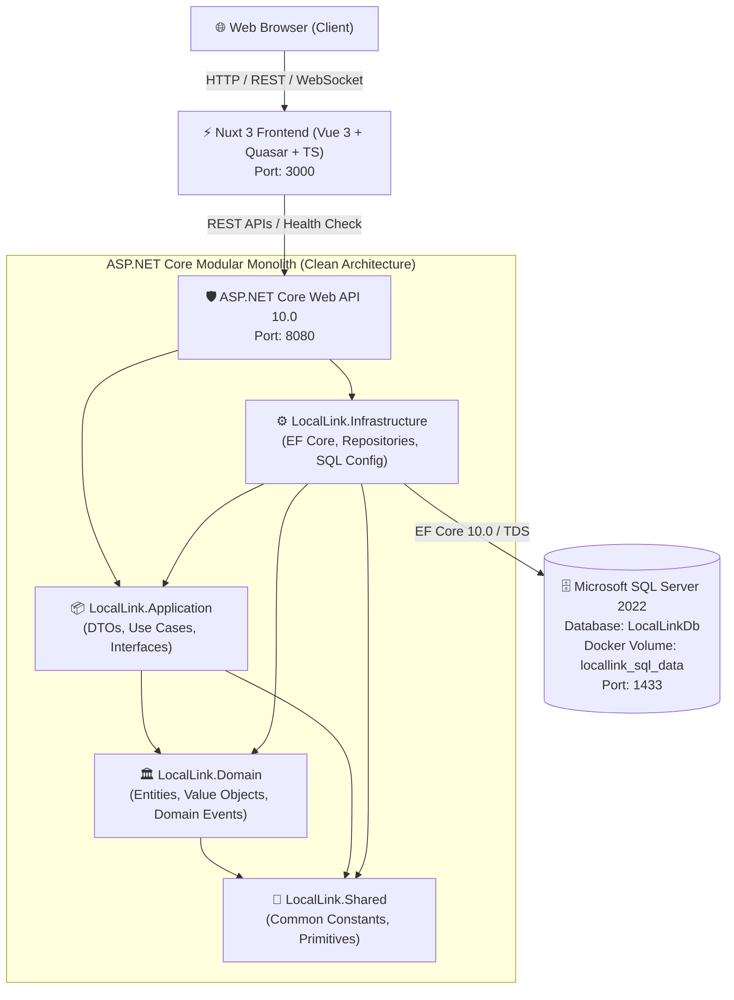

# InterLink Banking

**Cloud-native Connected Regional Banking & Local Services Platform**

InterLink Banking is an enterprise-ready, cloud-native financial platform designed for connected regional banking and localized digital financial services. Built with a robust **Modular Monolith + Clean Architecture**, the platform provides high-throughput transaction processing, resilient data persistence, and modern reactive client experiences.

---

## Architecture Overview



---

## Tech Stack

### Backend
- **Language**: C# 14 / .NET 10.0
- **Framework**: ASP.NET Core Web API
- **ORM / Persistence**: Entity Framework Core 10.0 (SQL Server Provider)
- **API Documentation**: OpenAPI / Swagger UI (Swashbuckle)
- **Diagnostics**: ASP.NET Core Health Checks (Process + EF Core SQL Server check)
- **Error Standard**: RFC 7807 ProblemDetails Global Exception Handling
- **Security & Networking**: Configurable CORS Policy

### Frontend
- **Framework**: Nuxt 3 (SSR & SPA modes)
- **Core Library**: Vue.js 3 + TypeScript
- **Component UI**: Quasar Framework 2.x
- **Icons & Typography**: Material Icons, Outfit & Plus Jakarta Sans
- **State & HTTP**: Built-in Nitro Server Engine + `$fetch` Client with Runtime Configuration

### Database & DevOps
- **Database Engine**: Microsoft SQL Server 2022 (`mcr.microsoft.com/mssql/server:2022-latest`)
- **Containerization**: Docker & Multi-stage Dockerfiles (SDK/Builder -> Minimal Runtime)
- **Orchestration**: Docker Compose with Health Checks and Named Persistent Volumes
- **Configuration**: Environment Variables & `.env` files

---

## Project Structure

```text
LocalLink/
├── backend/
│   ├── LocalLink.sln
│   ├── Dockerfile
│   ├── dotnet-tools.json
│   └── src/
│       ├── LocalLink.API/                    # Presentation / Web API Layer
│       │   ├── Controllers/
│       │   │   └── SystemController.cs
│       │   ├── Extensions/
│       │   │   ├── CorsExtensions.cs
│       │   │   ├── HealthCheckExtensions.cs
│       │   │   └── SwaggerExtensions.cs
│       │   ├── Middleware/
│       │   │   └── GlobalExceptionHandlerMiddleware.cs
│       │   ├── Program.cs
│       │   ├── appsettings.json
│       │   └── appsettings.Development.json
│       │
│       ├── LocalLink.Application/            # Application Business Logic Layer
│       │   ├── DTOs/
│       │   │   └── SystemStatusDto.cs
│       │   ├── Interfaces/
│       │   ├── Services/
│       │   └── Validators/
│       │
│       ├── LocalLink.Domain/                 # Core Domain Entities & Rules
│       │   ├── Entities/
│       │   │   └── SystemInfo.cs
│       │   ├── Enums/
│       │   ├── Exceptions/
│       │   └── Interfaces/
│       │
│       ├── LocalLink.Infrastructure/         # Data Access & External Services Layer
│       │   ├── DependencyInjection/
│       │   │   └── DependencyInjection.cs
│       │   ├── Persistence/
│       │   │   ├── ApplicationDbContext.cs
│       │   │   ├── Configurations/
│       │   │   │   └── SystemInfoConfiguration.cs
│       │   │   └── Migrations/
│       │   │       └── 20260818045017_InitialCreate.cs
│       │   └── Repositories/
│       │
│       └── LocalLink.Shared/                 # Shared Primitives & Constants
│           └── Common/
│               └── AppConstants.cs
│
├── frontend/
│   ├── Dockerfile
│   ├── nuxt.config.ts
│   ├── package.json
│   ├── tsconfig.json
│   ├── app.vue
│   ├── pages/
│   │   └── index.vue
│   ├── plugins/
│   │   └── quasar.client.ts
│   ├── services/
│   │   └── api.ts
│   ├── types/
│   │   └── index.ts
│   └── public/
│
├── docker-compose.yml
├── .dockerignore
├── .env.example
├── .env
├── .gitignore
└── README.md
```

---

## Prerequisites

Ensure the following tools are installed on your machine:
- [.NET 10 SDK](https://dotnet.microsoft.com/)
- [Node.js (v20+ or v24 LTS)](https://nodejs.org/) & `npm`
- [Docker Desktop](https://www.docker.com/products/docker-desktop/) (Docker Engine + Docker Compose)
- [Git](https://git-scm.com/)

---

## Environment Configuration

Copy the sample environment file to `.env`:

```bash
cp .env.example .env
```

Default local environment settings in `.env`:

```ini
# Database (SQL Server 2022)
DB_NAME=LocalLinkDb
DB_USER=sa
DB_PASSWORD=YourStrongPassword123!
SQL_SERVER_PORT=1433

# Backend API
API_PORT=8080
ASPNETCORE_ENVIRONMENT=Development

# Frontend Web
WEB_PORT=3000
NUXT_PUBLIC_API_BASE_URL=http://localhost:8080
```

---

## Run With Docker Compose (Recommended)

To build and start all services with persistent volume and automatic healthchecks:

```bash
# Build and start all services in detached mode
docker compose up --build -d

# View real-time container logs
docker compose logs -f

# Stop services (keeps database volume intact)
docker compose down
```

### Access Endpoints
- **Frontend Web UI**: [http://localhost:3000](http://localhost:3000)
- **API Health Check**: [http://localhost:8080/health](http://localhost:8080/health)
- **API System Telemetry**: [http://localhost:8080/api/system](http://localhost:8080/api/system)
- **OpenAPI / Swagger UI**: [http://localhost:8080/swagger](http://localhost:8080/swagger)
- **SQL Server Port**: `localhost:1433` (Username: `sa`, Password: `YourStrongPassword123!`)

---

## Run Backend Manually

1. **Start SQL Server container**:
   ```bash
   docker compose up -d locallink-sqlserver
   ```
2. **Apply EF Core Migrations**:
   ```bash
   cd backend
   dotnet tool restore
   dotnet dotnet-ef database update --project src/LocalLink.Infrastructure --startup-project src/LocalLink.API
   ```
3. **Run the API**:
   ```bash
   dotnet run --project src/LocalLink.API
   ```

---

## Run Frontend Manually

```bash
cd frontend
npm install
npm run dev
```
The frontend will start at [http://localhost:3000](http://localhost:3000).

---

## EF Core Migrations

To add a new migration in future milestones:

```bash
cd backend
dotnet dotnet-ef migrations add <MigrationName> \
  --project src/LocalLink.Infrastructure \
  --startup-project src/LocalLink.API \
  --output-dir Persistence/Migrations
```

To apply migrations to the database:

```bash
cd backend
dotnet dotnet-ef database update \
  --project src/LocalLink.Infrastructure \
  --startup-project src/LocalLink.API
```

---

## Health Checks & Diagnostic Endpoints

### `/health`
Returns system status along with the health of each registered dependency:
```json
{
  "status": "Healthy",
  "totalDurationMs": 25.47,
  "entries": [
    {
      "key": "self",
      "status": "Healthy",
      "durationMs": 1.02
    },
    {
      "key": "sqlserver",
      "status": "Healthy",
      "durationMs": 20.55
    }
  ]
}
```

### `/api/system`
Returns technical system runtime telemetry:
```json
{
  "application": "LocalLink",
  "status": "running",
  "environment": "Development",
  "database": "connected",
  "timestampUtc": "2026-08-18T05:04:34Z",
  "version": "1.0.0"
}
```

---

## Docker Services

| Service | Container Name | Image | Port | Description |
| :--- | :--- | :--- | :--- | :--- |
| **locallink-web** | `locallink-web` | Custom (Node 24 Alpine) | `3000:3000` | Nuxt 3 Frontend client |
| **locallink-api** | `locallink-api` | Custom (ASP.NET 10.0) | `8080:8080` | ASP.NET Core REST API Gateway |
| **locallink-sqlserver** | `locallink-sqlserver` | `mssql/server:2022-latest` | `1433:1433` | Microsoft SQL Server 2022 Engine |

---

## Development Roadmap

- [x] **Milestone 1**: Project Foundation (Backend, Frontend, SQL Server 2022, Docker Compose) ✅
- [ ] **Milestone 2**: Database Design & Banking Entities (Schema, Migrations, Seeders)
- [ ] **Milestone 3**: Authentication + JWT + Refresh Token + RBAC
- [ ] **Milestone 4**: Customer Management & Bank Accounts
- [ ] **Milestone 5**: Transfer Engine, Transactions & Audit Log
- [ ] **Milestone 6**: Frontend Banking Dashboard UI
- [ ] **Milestone 7**: Bill Payment System & Notifications
- [ ] **Milestone 8**: Comprehensive Integration & Docker Testing
- [ ] **Milestone 9**: Cloud Deployment (Azure) & CI/CD Pipelines
- [ ] **Milestone 10**: Terraform Infrastructure as Code & Observability (Prometheus, Grafana)
